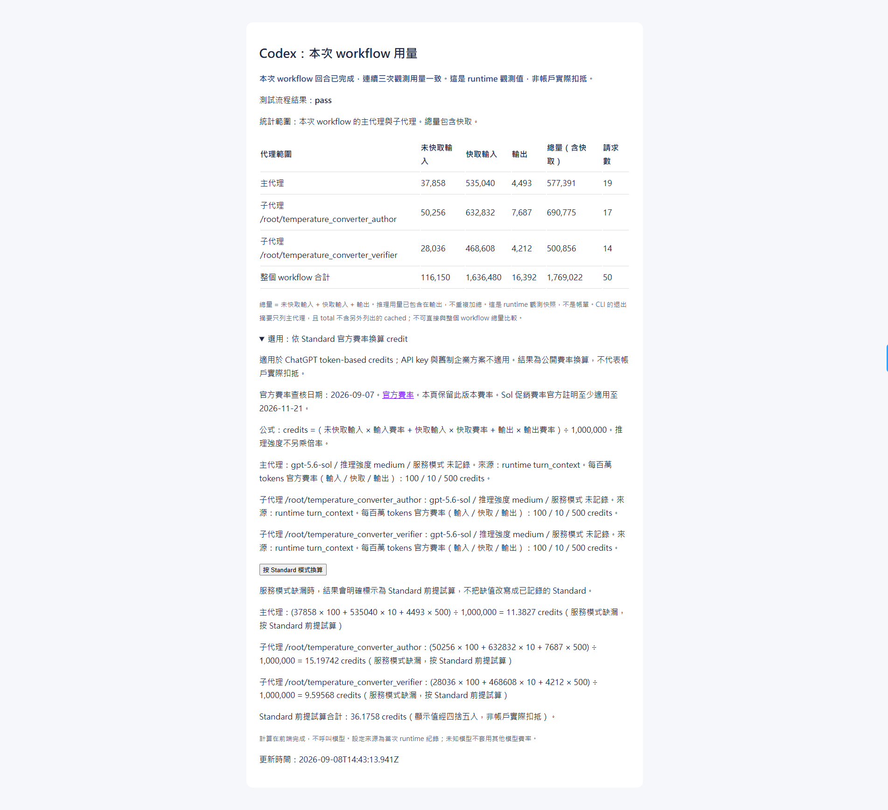

# .NET Testing Agent Orchestration for Codex Lite


Lite driver 不產生 token 估算，也不把用量數字寫入 machine result。支援的 Codex CLI
與 VS Code Extension 會在一般 Lite workflow 回合外自動觀測 runtime 用量，並在最終報告
附上本機網頁網址；觀測值不是帳單。以下既有 benchmark 數值屬歷史實驗，不是本次執行的用量報告。
只處理 .NET Unit Test 的輕量、自含 Codex workflow。它以兩個專責 subagent
降低重複 context，並用實際 build、test 與 target-scoped coverage 驗證結果。

## 用量網頁與 credit 試算

在 Codex CLI 或 VS Code Extension 執行 Lite workflow 後，最終報告會提供可複製的本機網頁網址。開啟網頁即可查看主代理、Author、Verifier 與整個 workflow 的未快取輸入、快取輸入、輸出、總 tokens 及請求數。背景觀測完成後，頁面會顯示用量已收尾；不需要退出 Codex 或另跑收集命令，也不會自動開啟瀏覽器。

展開網頁的「選用：依 Standard 官方費率換算 credit」，再按「按 Standard 模式換算」，即可查看各代理與合計試算。頁面同時列出模型、推理強度、服務模式、保存的費率版本與計算公式。**這是依 Standard 前提換算的參考值，不是帳戶實際扣抵；服務模式未記錄時仍會明示未知。**

v1.2.2 加入 `gpt-6.1-sol`：依 2026-10-07 查核的官方 Standard 費率，每百萬未快取
輸入／快取輸入／輸出為 50／2.5／250 credits；既有 GPT-6 Sol、Luna、Astra 換算保留。

操作步驟、已驗收的用量範例及保存方式見[用量網頁與 credit 試算](docs/usage.md#用量網頁與-credit-試算)。

v1.2.2 的 Windows Codex CLI 完整驗證中，net10 `SubscriptionService` 54/54 測試通過，
Line／Branch 皆 100%，主代理、Author、Verifier 均為 `gpt-6.1-sol`／`medium`。
實際用量報表的 Standard 前提 credit 合計 11.77946，與獨立重算一致；服務模式未記錄。
詳細情境與限制見[修正後人工驗證](docs/usage.md#v122-修正後-windows-人工驗證)。

v1.2.1 的 Windows Codex CLI 完整驗證中，NuGet 預檢回傳 `ready`、`packages: null`，
32/32 測試通過，Line 39/39、Branch 22/22（皆 100%）。主代理、Author 與 Verifier 均為
`gpt-6-sol`／`medium`；整個 workflow 用量 1,298,262 tokens（含快取）、39 requests。
保留 `NU1900` 弱點資料查詢警告。詳細條件與用量範圍見
[使用說明](docs/usage.md#v121-windows-完整流程驗證)。

以下 v1.2.0 的 Windows Codex CLI 完整驗證為歷史紀錄：NuGet 預檢回傳 `ready`，32/32 測試通過，
Line／Branch coverage 均為 100%。主代理、Author 與 Verifier 的 runtime 模型均為
`gpt-6-sol`／`medium`；用量 963,642 tokens（含快取），依頁面保存費率的 Standard
前提試算為 10.54162 credits，非帳戶實際扣抵。完整條件見[使用說明](docs/usage.md#v120-完整流程驗證)。



圖為 2026-09-08 的歷史 Windows CLI 驗收，使用當時的 GPT-5.6 Sol 配置：50 requests、
1,769,022 tokens（含快取），依當時頁面保存費率的 Standard 前提試算為 36.1758 credits，
非帳戶實際扣抵；上方 v1.2.0 驗證沒有使用這張截圖。

## Workflow

```text
Lite Orchestrator
  → 目前 Codex 沙箱的 NuGet 還原預檢
  → deterministic driver（run identity、gates、terminal state）
  → Lite Unit Author（分析目標並撰寫測試）
  → Lite Unit Verifier（build、test、coverage、品質檢查）
  → 有合理可補缺口時，最多一次 Author repair → Lite Unit Verifier final
```

### Lite agent 預設模型

| Agent 設定 | 預設模型 | 推理強度 |
| --- | --- | --- |
| `.codex/agents/dotnet-testing-lite-unit-author.toml` | GPT-6 Sol（`gpt-6-sol`） | `medium` |
| `.codex/agents/dotnet-testing-lite-unit-verifier.toml` | GPT-6 Sol（`gpt-6-sol`） | `medium` |

兩個 Lite agent 都預設使用 GPT-6 Sol／medium。用量網頁依 runtime 記錄的模型與
Standard 費率換算 credit；目前支援 GPT-6 Sol 與 GPT-6 Luna。這項設定不改變
workflow topology、repair 額度、coverage 規則或品質門檻；需要採用其他模型時，
可直接調整對應 TOML 的 `model` 與 `model_reasoning_effort`。

## 使用方式

從已信任的 workspace root 啟動 Codex，或以 CLI 的 `-C <workspace-root>` 明確指定目錄；
確認 repo-local skill 可見後輸入：

```text
呼叫 $dotnet-testing-lite-orchestrator-unit。
target source: src/MyProject/PriceCalculator.cs
target class: PriceCalculator
test project: tests/MyProject.Tests/MyProject.Tests.csproj
目標是合理可測程式碼的 line/branch coverage 盡量 100%。
```

`test project` 可以指向既有 csproj，也可以是預計建立的新 path。新專案會依
solution 的 target framework、中央套件版本與 project reference 建立最小 xUnit
scaffold。

Orchestrator 在建立 run 前，先於目前 Codex 沙箱對既有 test project 執行 NuGet 還原預檢；
若 test project 尚未建立，改預檢 target 對應的來源專案。只有預檢回傳 `ready` 才啟動 driver
與派遣具名 Author、Verifier。一般啟動不需要設定 `NUGET_PACKAGES` 或為 NuGet 修改
`.codex/config.toml`；未設定時沿用 `NuGet.Config` 與預設快取，明確設定時才檢查並使用
指定快取。還原受阻時會保留診斷並停止，先依錯誤檢查套件來源、快取或存取問題。
只有確認所需套件位於另一個可讀快取、且目前環境未使用時，才考慮選用 CLI override。
指令與限制見[使用說明](docs/usage.md#prompt)。

每次 workflow 的測試與用量證據會保存在 test project 的 `.orchestrator/runs/`，不會自動清除。
Windows、macOS 與 Linux 可使用相同的 Node.js CLI 預覽並清理已完成 run；未加 `--apply`
不會刪除：

```text
node .codex/scripts/dotnet-testing-codex-lite/usage/cleanup.mjs --test-project <test-project.csproj> --older-than-days 30 --keep 10
node .codex/scripts/dotnet-testing-codex-lite/usage/cleanup.mjs --test-project <test-project.csproj> --older-than-days 30 --keep 10 --apply
```

工具不會刪除 active、仍在執行、狀態無法確認或用量 observer 尚未收尾的 run。

## 內建資產

- `.codex/agents/`：Lite Unit Author 與 Lite Unit Verifier。
- `.codex/skills/dotnet-testing-lite-orchestrator-unit/`：唯一 workflow 入口。
- `.codex/scripts/dotnet-testing-codex-lite/`：唯一 workflow driver、deterministic gates、artifact helpers、
  build-first runner、Cobertura parser 與結果驗證。
- `.codex/skills/*-lite/`：13 個獨立 Unit testing skills 與必要 references／templates。
- `samples/unit/practice/`：net8.0、net9.0、net10.0 空白練習矩陣。

本 repo 不需要 clone 或安裝其他 testing-skill repository。Bogus 不在 lite
workflow；AutoFixture 只在複雜 object graph 時條件式使用。

13 個 Unit skills 都是可選技術來源，不是固定 routing 或必載清單。Agent 只有在
具體技術疑問無法由 source、project、gates 與實測證據解決時，才選讀最少相關來源。

本 workflow 可與外部 `.codex/skills/dotnet-test` 安裝在同一個 workspace，
再依情境選用。Lite 的入口與內部 helper 全部集中於
`.codex/scripts/dotnet-testing-codex-lite/`，避免覆寫外部 skill。
安裝時必須合併 workspace 的 `.codex/config.toml`，不可用任一 repo 的完整設定檔
覆寫另一份；README、CHANGELOG 與 samples 也不屬於疊加安裝資產。

## 獨立部署與升級

目前版本為 v1.2.2，新增 GPT-6.1 Sol credit 換算並修正派遣前的交付目錄準備，
變更與驗證範圍見 [CHANGELOG](CHANGELOG.md)。上方 v1.2.0 數據為歷史驗收。

本次 runtime 使用 `.codex/scripts/dotnet-testing-codex-lite/`，13 個技術技能使用
`.codex/skills/*-lite/`；不依賴 Full 部署資產。安裝範圍為工作區，不建立全域安裝。
Release 的 ZIP 與 tar.gz 不包含 Full 專用的 `estimate-token-usage.mjs`、
`run-state.mjs` 或根目錄 `scripts/`；`.codex/scripts/` 只允許
`dotnet-testing-codex-lite/**`。發布流程會下載兩種 GitHub 原始碼封存檔逐份驗證並記錄 SHA-256。
完整安裝、更新、移除與共用設定合併範例見 [使用說明](docs/usage.md#獨立安裝更新與移除)。
舊版 runtime 只清除能以基準雜湊辨識的檔案；外來檔案、外部 skills 及歷史 runs 保留。

## v1.1.0 deterministic workflow重整

v1.1.0因應`dotnet-testing-agent-skills v2.4.2`，把模型責任收斂為測試語意工作，並將
workflow state、machine truth、integrity、artifact、timing與繁中final交由
deterministic driver維護；本次將其移至 `.codex/scripts/dotnet-testing-codex-lite/`。

- Orchestrator只啟動driver、依action調度固定Author→Verifier拓樸，並逐字交付final。
- Author只建立高價值xUnit Unit Tests、處理test-only問題與唯一一次有限repair。
- Verifier對production與test delivery唯讀，獨立驗證build、test、target-scoped coverage及
  重要可測缺口。
- No-test、blocked、not-suitable與environment protection均有獨立machine state，不以測試數量、
  scenario拆分、skill選擇或低嚴重度措辭差異判定失敗。

Repository tests為125/125通過；public snapshot固定為179個檔案、2個Lite agents與13個Unit
skills。Final candidate的影響導向live批次為3/3 `hard-pass`，且production mutation為0。

## v1.0.0 Lite script 命名空間驗證

v1.0.0 將 Lite runtime 的入口統一為 `lite-` 前綴，helper 移至
`.codex/scripts/dotnet-testing-codex-lite/`，讓 Lite 與原版 workflow 可以共存。這次只調整 runtime
路徑與引用，沒有改變 workflow topology、repair 額度、coverage 規則或品質門檻。

改名後以 GPT-5.6 Luna／max 的 Lite Author、Verifier 重新執行固定 10-run matrix；
outer coordinator 固定為 GPT-5.6 Sol／medium：

| 驗證項目 | 結果 |
| --- | ---: |
| Outer runs | 10/10 完成 |
| Target executions | 12/12 完成 |
| Terminal decision | 8 pass、4 best_effort |
| Quality gate | 12/12 pass |
| 使用 repair | 6/12 targets |
| Aggregate raw input + output | 15,834,891 tokens |
| Workflow duration 合計 | 8,833,270 ms（約 2:27:13） |
| Production source mutation | 0 |

這批歷史 run 使用當時的 Lite 專屬 runtime。現行 runtime 已集中在
`.codex/scripts/dotnet-testing-codex-lite/`，不再散置於 `.codex/scripts/` 與根目錄 `scripts/`。
Token telemetry 混合 outer 與 Lite agents，不能視為 Luna 單一模型的實際用量或
provider 帳單。Public release 保留這份驗證摘要；raw `.workflow`、controller、
incident 與 run workspace 不在發布範圍內。

## Coverage 與品質

正式 runner 先執行 `dotnet build`，成功後才用 `dotnet test --no-build` 收集
XPlat Code Coverage。Coverage 以指定 target class 的 Cobertura line／branch
結果計算，不使用 assembly 平均值。

100% 是合理可測程式碼的預設目標，不是硬造假門檻。若剩餘路徑無法由合理
Unit Test 覆蓋，結果會保留 uncovered lines／branches 與原因。Coverage 與品質
共用一次 repair 額度，避免反覆嘗試造成無上限成本。

## 模型計價與 30-run 實驗

以下為 Standard／short-context API 美元費率與 ChatGPT Codex Credit rate，
單位皆為每 1M tokens；順序為 uncached input／cached input／output。

| 模型與強度 | API 費率 | Codex Credit 費率 |
| --- | ---: | ---: |
| GPT-5.5 medium | $5／$0.50／$30 | 125／12.5／750 credits |
| GPT-5.6 Sol medium | $5／$0.50／$30 | 125／12.5／750 credits |
| GPT-5.6 Terra max | $2／$0.20／$12 | 50／5／300 credits |
| GPT-5.6 Luna max | $0.20／$0.02／$1.20 | 5／0.5／30 credits |

> **GPT-5.6 Sol 與 GPT-5.5 的單位費率相同。** Reasoning effort 不改變
> 單位費率，但會影響實際 token 用量、耗時與總成本。

實驗在同一份 source、10-run matrix、workflow topology、prompt、skills、scripts、
repair 規則與品質門檻下，比較三組 Lite Author／Verifier；每組各 10 runs，共
30 runs／36 target executions。三組 outer coordinator 都固定為 GPT-5.6 Sol
medium，因此 Sol 不是第四組 Lite candidate。這些是歷史固定配置的實驗結果，
不代表目前兩個 Lite agent 的預設 model tuple。

| Lite 配置 | Raw tokens | Workflow span | Quality pass | Repair targets | API 成本估算 | Credits 估算 | 占 400 credits |
| --- | ---: | ---: | ---: | ---: | ---: | ---: | ---: |
| GPT-5.5 medium | 15,224,236 | 7,624.281 秒 | 12/12 | 2 | $14.249731 | 356.243275 | 89.06% |
| GPT-5.6 Luna max | 19,474,169 | 10,223.138 秒 | 11/12 | 5 | $0.702770 | 17.569258 | 4.39% |
| GPT-5.6 Terra max | 19,910,275 | 13,887.696 秒 | 8/12 | 6 | $7.089931 | 177.248280 | 44.31% |

成本是把每格 aggregate runtime usage 全部套用該組 Lite model 費率的容量規劃
估算。Telemetry 混合 outer Sol 與 Lite agents，沒有 per-model breakdown，因此
不是 provider 帳單或企業後台實際扣款；reasoning output 已包含於 output，不重複
計價。Workflow span 來自 run manifests，也不是 outer end-to-end wall-clock time。

若只把既有三組 aggregate tokens 全部套用 Sol medium 費率，估算分別為
356.243275、439.231450、443.120700 credits。這是費率敏感度分析，不是 Sol
medium 的獨立 10-run token、品質或耗時實測。

完整紀錄：

- [實驗結案報告](docs/benchmarks/gpt55-medium-vs-gpt56-luna-terra-max/closing-report.md)
- [逐格與聚合技術摘要](docs/benchmarks/gpt55-medium-vs-gpt56-luna-terra-max/summary.md)
- [Machine-readable 30-run 結果](docs/benchmarks/gpt55-medium-vs-gpt56-luna-terra-max/result.json)
- [OpenAI API Pricing](https://developers.openai.com/api/docs/pricing)
- [Codex Pricing 與 Credit rate card](https://learn.chatgpt.com/docs/pricing)

## 文件

- [架構](docs/architecture.md)
- [使用方式](docs/usage.md)
- [版本紀錄](CHANGELOG.md)

## 開發來源

此 public repo 是由 private lite lab 的發布白名單自動產生的 consumer snapshot。
版本 tag 與 GitHub Release 均指向同步後的 public commit。


## Workflow 用量資料的留存與清除

**預設留存，由使用者明確清除。開始下一次 workflow 不會刪除前一次結果，也沒有自動到期清理。**
每次執行新增資料；`.gitignore` 只避免簽入，不會釋放磁碟空間。

| 資料 | 位置 |
|---|---|
| 用量網頁、JSON、TRX、coverage 與執行證據 | 測試專案目錄下 `.orchestrator/runs/<run-id>/<target>/` |
| 用量防重複索引 | 已部署工作區根目錄下 `.orchestrator/dotnet-testing-lite/usage-turns/` |

在已安裝 Lite 的工作區根目錄執行。以下以隨附 net10 練習專案為例；其他專案請替換引號內的 `.csproj` 路徑。
Windows PowerShell、macOS 與 Linux 使用相同命令，清除只需要 Node.js 20.11+；Python／SQLite 是用量收集的相依，不是清除的前提。

先預覽此測試專案全部可清除的已完成 run 與對應索引：

```text
node .codex/scripts/dotnet-testing-codex-lite/usage/cleanup.mjs --test-project "samples/unit/practice/tests/Practice.Core.Net10.Tests/Practice.Core.Net10.Tests.csproj" --all-completed
```

確認清單並備份需要的證據後，加上 `--apply` 才會實際刪除：

```text
node .codex/scripts/dotnet-testing-codex-lite/usage/cleanup.mjs --test-project "samples/unit/practice/tests/Practice.Core.Net10.Tests/Practice.Core.Net10.Tests.csproj" --all-completed --apply
```

**刪除單位是整個 run，不是只有用量網頁。** HTML、JSON、TRX、coverage 與該 run 的其他證據一併刪除，
原網頁網址失效，不經資源回收筒；本次成功刪除 run 的索引同步移除。
測試原始碼、`.csproj`、`bin/obj` 與 Codex 使用者目錄的 sessions／SQLite 不會被刪除。
正在執行、observer 尚未收尾或狀態無法確認的 run 會保留；不要直接整棵刪除 `.orchestrator`。

輸出 `selected` 與 `indexCleanup.selected` 是預覽範圍；`removed` 與 `indexCleanup.removed` 是實際刪除結果。
`skipped` 列出跳過原因；`failures` 非空時命令回傳非零，可能已有部分 run 刪除成功。
指定單次 run、保存天數及保留最近 N 次的命令，見[完整清理說明](.codex/scripts/dotnet-testing-codex-lite/usage/README.md#保存與清理)。
